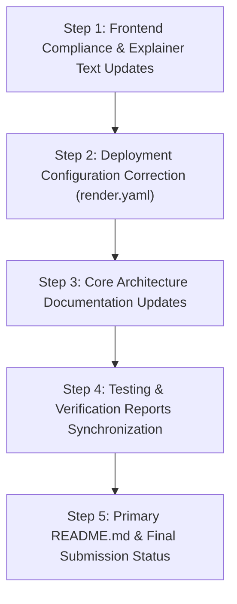

# Current-State System & Architecture Audit Report

**Project:** Smart Internship Management & Monitoring System (`smart-internship-monitoring`)  
**Auditor:** Senior Software Architect & Lead Release Engineer  
**Audit Date:** September 30, 2026  
**Repository State:** Code Complete (Phase 1 Deterministic Core + Phase 2 Enterprise Workflows + Phase 3 ML Early-Warning & SHAP Explainability)  
**Execution Context:** Verification prior to documentation synchronization and release packaging  

---

## Executive Summary

A comprehensive, zero-assumption architectural and code audit of the entire `smart-internship-monitoring` repository was conducted. Every subsystem—including the Next.js 14 frontend, FastAPI backend, SQLAlchemy ORM models, deterministic intelligence engine, scikit-learn ML early-warning pipeline, SHAP explainability layer, automated test suites (pytest and Playwright), environment configurations, deployment artifacts, and all existing documentation—was inspected directly from the ground-truth source code.

### High-Level Verdict:
The application's **actual code implementation is exceptionally advanced, robust, and functional**:
- The **backend** implements clean RESTful endpoints with strict JWT authentication, role guards, anti-tampering ownership validation, and a hybrid decision layer.
- The **frontend** implements a modern Next.js 14 Stitch Liquid Glass interface across Student, Mentor, and Admin workspaces, with responsive mobile navigation and interactive modal dialogs.
- The **intelligence layer** features both a 4-factor deterministic scoring engine and a trained Scikit-Learn `RandomForestClassifier` early-warning model with local SHAP feature attributions and hard institutional safety guardrails.
- All **75 backend and intelligence unit/integration tests pass (100%)**, and the **Playwright E2E suite contains 118 unique end-to-end tests (354 cross-browser executions)** across Chromium, Firefox, and Mobile Chrome.

However, the repository suffers from **significant documentation drift, stale historical reports, and unsupported compliance claims**:
1. **"100% Deterministic" vs. ML Early-Warning Contradiction:** Several primary documents (`README.md`, `TECHNICAL_ARCHITECTURE.md`, `DEPLOYMENT.md`, `FINAL_SUBMISSION_STATUS.md`, and frontend modals) claim the system is "100% deterministic with zero machine learning or probabilistic algorithms", completely ignoring the Phase 3 ML Early-Warning pipeline and SHAP explainer active in `backend/app/routers/students.py` and `frontend/src/components/ProgressAttentionCard.tsx`.
2. **Test Count Mismatches:** Documentation cites outdated test counts (`61 tests`, `63 passed`, `40 intelligence + 21 backend`), whereas the live pytest suite currently has **75 passing tests** (including 21 dedicated ML pipeline tests), and Playwright contains **118 unique tests across 14 spec files** (not 79 across 13 suites).
3. **Fictitious / Unsupported Compliance Claims:** The frontend landing and login pages display trust badges claiming `"SOC-2 Type II Certified"`, `"FERPA Compliant"`, and `"FERPA & GDPR"`, none of which are audited or legally attested for this prototype application.
4. **Architectural Directory Inaccuracies:** `docs/TECHNICAL_ARCHITECTURE.md` describes an obsolete directory structure (separate `user.py`, `internship.py` models, a nonexistent `backend/app/services/` layer, and `passlib` authentication), whereas the actual code consolidates models in `backend/app/models/__init__.py`, schemas in `backend/app/schemas/__init__.py`, embeds business logic in routers, and utilizes direct `bcrypt`.
5. **Deployment Blueprint Bug:** `render.yaml` sets `NEXT_PUBLIC_API_URL` to `http://localhost:8000/api`, which would cause production frontend deployments on Render to fail client-side API requests.

---

## 1. Actual Current Architecture (From Source Code)

### 1.1 Architectural Topology

$$\mathbf{Next.js\ 14\ App\ Router\ (Frontend)} \overset{\text{Bearer JWT / JSON}}{\longleftrightarrow} \mathbf{FastAPI\ (Backend)} \overset{\text{In-Process / ORM}}{\longleftrightarrow} \begin{cases} \mathbf{SQLite\ /\ PostgreSQL} & \text{(Relational Persistence)} \\ \mathbf{Deterministic\ Engine} & \text{(4-Factor Progress Core)} \\ \mathbf{ML\ Early\ Warning\ Engine} & \text{(RandomForest + SHAP)} \end{cases}$$

### 1.2 Subsystem Breakdown

#### A. Frontend Architecture (`frontend/`)
- **Framework:** Next.js 14.2.35 (React 18.3.1, TypeScript 5.7, Tailwind CSS 3.4).
- **Design System:** Custom Google Stitch "Liquid Glass" theme with CSS glassmorphism (`backdrop-blur-xl`, custom SVG gradients, refined card surfaces, semantic status badges).
- **Routing & Pages:**
  - `/` (`frontend/src/app/page.tsx`): High-converting institutional landing page with product showcase, persona selector, interactive preview tabs, and accreditation footer.
  - `/login` (`frontend/src/app/login/page.tsx`): Role-aware authentication page with 1-click persona quick-fill buttons (`Student (On Track)`, `Student (Needs Attention)`, `Faculty Mentor`, `Administrator`).
  - `/register` (`frontend/src/app/register/page.tsx`): Public registration for Students and Mentors (rejects Admin role client- and server-side).
  - `/student` (`frontend/src/app/student/page.tsx`): Student workspace featuring active internship details, 4-factor progress attention card, live task completion checklist with instant recalculation, weekly report submission form, and skill gap checker.
  - `/mentor` (`frontend/src/app/mentor/page.tsx`): Faculty supervisor portal with prioritized student triage roster, pending report grading modal (1–100 score + feedback), and intervention logger.
  - `/admin` (`frontend/src/app/admin/page.tsx`): Institutional command center with KPI metrics, intervention queue, pending application approval workflow, and mentor allocation.
- **State & Session Management:**
  - `frontend/src/lib/auth.tsx`: `AuthProvider` context managing `user`, `token`, and `role`. Tokens stored in browser `localStorage` under `eduintern_token`.
  - `frontend/src/lib/api.ts`: Centralized fetch wrapper automatically injecting `Authorization: Bearer <token>` and resolving against `process.env.NEXT_PUBLIC_API_URL || 'http://localhost:8000/api'`.

#### B. Backend Architecture (`backend/`)
- **Framework:** FastAPI 0.141.1 running on Uvicorn 0.53.0 with Python 3.14.
- **Lifespan Management:** `backend/app/main.py` uses modern `asynccontextmanager` to create tables via `Base.metadata.create_all()` and invoke `seed_database(db)` on startup.
- **Routers (`backend/app/routers/`):**
  - `auth.py`: `/api/auth/register`, `/api/auth/login`, `/api/auth/me`.
  - `students.py`: Student self-service (`/api/students/me`, `PUT /api/students/me`, `/api/students/me/internship`, `/api/students/me/applications`, `/api/students/me/tasks`, `/api/students/me/tasks/{task_id}/toggle`, `/api/students/me/reports`, `POST /api/students/me/reports`, `/api/students/me/attention`).
  - `mentors.py`: Supervisor actions (`/api/mentors/me/interns`, `/api/mentors/interns/{student_id}`, `/api/mentors/reports/{report_id}/review`, `/api/mentors/interventions`).
  - `admin.py`: Institutional oversight (`/api/admin/analytics`, `/api/admin/applications`, `/api/admin/applications/{id}/action`, `/api/admin/mentors`, `/api/admin/internships`, `/api/admin/students`).
  - `internships.py`: Catalog & applications (`GET /api/internships`, `POST /api/internships`, `POST /api/internships/{id}/apply`).
  - `analytics.py`: External analytics bridge (`POST /api/analytics/skill-gap`, `GET /api/analytics/progress-attention/{student_id}`, `POST /api/analytics/evaluate-progress-simulation`).
- **Security & Authorization (`backend/app/core/`):**
  - Password Hashing: Direct `bcrypt` 5.0 salting (`bcrypt.gensalt()`, `bcrypt.hashpw()`, `bcrypt.checkpw()`). No `passlib` dependency.
  - JWT Tokens: Signed with HS256 via `PyJWT` 2.14, 24-hour expiration, containing `sub`, `role`, and `exp`.
  - RBAC: FastAPI dependencies (`get_current_user`, `get_current_student`, `get_current_mentor`, `get_current_admin`).
  - Ownership Enforcement: Handlers verify `task.student_id == student.id` and restrict attention analytics to assigned supervisors or self.
  - Production Guardrails: Fails startup in `production` mode if default secret key is detected.

#### C. Database Models (`backend/app/models/__init__.py`)
- Declarative SQLAlchemy 2.0 entities:
  1. `User`: Core authentication entity (`email`, `hashed_password`, `full_name`, `role`, `is_active`).
  2. `Student`: Academic profile linked to User (`roll_number`, `department`, `academic_year`, `phone`).
  3. `Mentor`: Supervisor profile linked to User (`department`, `designation`, `employee_id`).
  4. `Company`: Corporate internship sponsor (`name`, `industry`, `website`, `contact_email`).
  5. `Internship`: Allocated placement (`title`, `company_id`, `mentor_id`, `student_id`, `status`, `duration_weeks`, `start_date`, `end_date`).
  6. `StudentSkill`: Normalized technical skills associated with students.
  7. `InternshipSkill`: Required technical skills associated with internship listings.
  8. `Application`: Student placement applications (`student_id`, `internship_id`, `status`, `review_notes`).
  9. `Task`: Milestone deliverables with binary completion tracking (`is_completed`, `completed_at`, `due_date`).
  10. `WeeklyReport`: Periodic timesheet and milestone report (`week_number`, `achievements`, `challenges`, `hours_spent`, `status`, `mentor_feedback`, `mentor_score`).
  11. `Intervention`: Academic supervisor check-in audit records (`intervention_type`, `notes`, `action_taken`, `status`).
- **Database Note:** There is NO `Attendance` table in the database schema.

#### D. Intelligence & Analytics Layer (`intelligence/`)
1. **Deterministic Skill Gap Analysis (`intelligence/app/skill_gap.py`):**
   - Case-insensitive string matching, whitespace trimming, set deduplication.
   - Match calculation: $\text{Match} = \left(\frac{|\text{Matched}|}{|\text{Unique Required}|}\right) \times 100$. Division-by-zero safely returns $100.0\%$.
2. **Deterministic Progress Attention Engine (`intelligence/app/progress_analysis.py`):**
   - Linear 4-factor scoring:
     $$\text{Score} = (0.30 \times \text{Consistency}) + (0.30 \times \text{Tasks}) + (0.20 \times \text{Reports}) + (0.20 \times \text{Mentor Feedback})$$
   - Categorization: $\ge 75 \implies \text{ON\_TRACK}$, $50 - 74 \implies \text{MONITOR}$, $< 50 \implies \text{NEEDS\_ATTENTION}$.
   - Traceable, deduplicated reasons and recommendations.
3. **Feature Engineering Layer (`intelligence/app/features/progress_features.py`):**
   - Extracts 10 typed features from ORM objects: `task_completion`, `report_submission`, `mentor_feedback`, `attendance_rate` (defaults to `None`), `task_velocity`, `report_punctuality`, `days_since_last_activity`, `activity_consistency`, `progress_trend`, `days_remaining`.
   - Replaces collinear $0.5 T + 0.5 R$ consistency with calendar-based cadence: $0.50 \times \text{Week Coverage} + 0.30 \times \text{Recency} + 0.20 \times \text{Punctuality}$.
4. **Machine Learning Early-Warning Pipeline (`intelligence/app/ml/`):**
   - Dataset Generator (`dataset.py`): Generates 3,000 synthetic observations across 3 archetypes (On-Track, Monitor, Disengaged) with fixed random seed 42.
   - Preprocessing (`preprocessing.py`): `MLPreprocessor` handles boundary clamping, imputation (neutral feedback 75.0, punctuality 100.0, inactive 14d, remaining 30d), and one-hot trend encoding. Excludes `attendance_rate`.
   - Model (`model.py`): `RandomForestClassifier(n_estimators=100, max_depth=6, class_weight='balanced', random_state=42)`. Uses `GroupShuffleSplit` on synthetic student IDs to prevent data leakage.
   - Calibration & Performance on Synthetic Test Split (N = 450): Accuracy 95.78%, Precision 85.71%, Recall 91.14%, F1 88.34%, ROC-AUC 0.9874, Brier Score 0.0399, ECE 0.0549. These metrics are from synthetic demonstration data and do not establish real-world predictive validity.
   - Serialized Artifacts (`artifacts/`): `risk_model_v1.joblib` (499 KB) and `model_metadata.json` (trained UTC 2026-09-30).
   - Inference Predictor (`predictor.py`): Singleton `RiskPredictor` outputting `risk_probability` and `risk_label` (`LOW_RISK` vs `ATTENTION_RISK`).
5. **Explainability Layer (`explainer.py`):**
   - `SHAPExplainer` utilizes `shap.TreeExplainer` on the trained tree ensemble.
   - Generates top $k$ feature attributions with human-readable labels, qualitative impact (`HIGH`, `MEDIUM`, `LOW`), direction (`RISK` vs `PROTECTIVE`), and contextual explanations.
6. **Hybrid Intelligence Policy (`service.py`):**
   - Integrates deterministic baseline with predictive early-warning.
   - *Rule 1 (Baseline Truth):* Deterministic engine provides ground truth for completed work.
   - *Rule 2 (Severe Inactivity Override):* If `days_since_last_activity > 21`, status is forced to at least `MONITOR` with an administrative alert, overriding favorable ML probabilities.
   - *Rule 3 (Early-Warning Escalation):* If deterministic status is `ON_TRACK` but ML risk probability is $\ge 0.65$, status escalates to `MONITOR` with proactive intervention recommendations.
   - *Rule 4 (Graceful Fallback):* If ML artifacts fail to load, system transparently returns deterministic metrics with `model_available=False`.
   - *Rule 5 (Insufficient Data):* Students with $< 2$ elapsed weeks receive low-confidence cautions.

---

## 2. Actual Implemented Features vs. Documented Features

| Feature Area | Documented in Old Docs | Actually Implemented in Code | Status / Discrepancy |
| :--- | :--- | :--- | :--- |
| **Deterministic Attention Engine** | Yes (4 factors) | Yes (`intelligence/app/progress_analysis.py`) | Fully synchronized with math specifications. |
| **Feature Extraction Layer** | Partial | Yes (`intelligence/app/features/progress_features.py`) | 10 typed features, non-collinear consistency. |
| **ML Early-Warning Risk Model** | **Claimed "100% Deterministic / No ML" in README/Docs** | **Fully Implemented** (`intelligence/app/ml/`) | **Severe mismatch:** Code has RandomForest model; README and modals claim zero ML exists. |
| **SHAP Feature Explainability** | Not mentioned in README | Fully Implemented (`intelligence/app/ml/explainer.py`) | Integrated with UI via `ProgressAttentionCard`. |
| **Hybrid Decision Layer** | Not mentioned in README | Fully Implemented (`intelligence/app/ml/service.py`) | Inactivity overrides and early risk escalations active. |
| **Student Task Checklist** | Yes | Yes (`backend/app/routers/students.py` + UI) | Live toggle with instant attention score updates. |
| **Weekly Report Filing** | Yes | Yes (Submit in student, review in mentor) | Enforces duplicate prevention (409 Conflict). |
| **Supervisor Grading** | Yes | Yes (1–100 score + feedback in modal) | Persists to DB, updates student attention. |
| **Admin Allocation** | Yes | Yes (Accept/reject + mentor assignment) | Functional in Admin portal. |
| **Skill Gap Self-Assessment** | Yes | Yes (`/api/analytics/skill-gap` + UI) | Case-insensitive matching and suggestions. |
| **Attendance Tracking** | Mentioned in older PRD | Feature exists in schema as `None`; no DB table | Properly omitted from ML input features. |
| **Public Registration** | Student, Mentor, Admin | Student, Mentor only (Admin blocked) | Security fix implemented; docs need update. |
| **Demo Personas** | Varied names in docs | Rohan Patil, Alex Chen, Sneha Kulkarni, Aditya Joshi | Synchronized in `seed.py`. |

---

## 3. Documentation / Code Mismatches & Inconsistencies

### Inconsistency 1: "100% Deterministic Intelligence" vs. Actual ML/Hybrid Implementation
- **Files claiming "100% Deterministic":**
  - `README.md` (lines 8, 10, 50, 58)
  - `docs/TECHNICAL_ARCHITECTURE.md` (lines 37, 60)
  - `DEPLOYMENT.md` (line 21)
  - `FINAL_SUBMISSION_STATUS.md` (lines 43, 60, 167)
  - `FINAL_VERIFICATION_REPORT.md` (line 38)
  - `frontend/src/components/IntelligenceExplainerModal.tsx` (line 50: *"It does not use black-box machine learning models, probabilistic predictions, or autonomous decision-making algorithms."*)
  - `frontend/src/components/ProgressAttentionCard.tsx` (line 68: `subtitle = "Deterministic 4-Factor Monitoring Engine"`)
- **Actual Code Reality:**
  - `backend/app/routers/students.py` calls `evaluate_hybrid_attention(features)` which runs `predict_progress_risk()` and `explain_progress_risk()`.
  - API responses return `risk_probability`, `risk_label`, `model_version`, `model_available`, and `top_risk_factors`.
  - `ProgressAttentionCard.tsx` renders early-warning probability tags and risk chips.
  - `intelligence/app/ml/` contains a trained `RandomForestClassifier` and SHAP TreeExplainer.
- **Correction Required:** Update documentation to describe the **Hybrid Intelligence Architecture** (deterministic foundational health score + predictive ML early-warning and explainability layer). Update the frontend explainer modal and card subtitle to accurately describe the hybrid system.

### Inconsistency 2: Automated Test Count Claims
- **Files with Stale Test Counts:**
  - `README.md` Badge: `[![Tests: 63 passed]]`
  - `README.md` Section 4.3: `python -m pytest -v` `(61 tests)`
  - `README.md` Section 5: `40 unit tests` + `21 integration tests` = 61 tests
  - `FINAL_SUBMISSION_STATUS.md`: `61 / 61 PASSED`
  - `FINAL_VERIFICATION_REPORT.md`: `61 / 61 PASSED`
  - `PRODUCTION_READINESS_REPORT.md`: `61 / 61 PASSED`
- **Actual Test Suite Reality:**
  - `python -m pytest backend/tests intelligence/tests` runs **75 tests**:
    - `backend/tests/test_api_integration.py`: 23 tests
    - `intelligence/tests/test_ml_pipeline.py`: 21 tests
    - `intelligence/tests/test_progress_analysis.py`: 17 tests
    - `intelligence/tests/test_skill_gap.py`: 14 tests
    - **Total: 75 passed, 0 failed.**
- **Correction Required:** Update test badges, counts, and summaries across all documentation to **75 passed tests**.

### Inconsistency 3: Playwright Test Claims vs. Actual Configuration
- **Documented Claims:**
  - `README.md` (Section 4.5 & 5.1): claims `79 automated E2E tests across 13 suites`
  - `TESTING.md`: documents 13 suites (A through M) totaling `79 test cases`
- **Actual Test Suite Reality:**
  - In `tests/`, there are **14 test spec files** (including `tests/security/security-audit.spec.ts` which has 39 automated security tests).
  - Total unique tests in `tests/`: $79 + 39 = \mathbf{118\ \text{tests}}$.
  - `playwright.config.ts` configures 3 projects: `chromium`, `firefox`, and `Mobile Chrome`.
  - When running `npx playwright test --list`, Playwright reports **354 total test runs** ($118 \times 3$).
  - In `playwright.config.ts` line 52: webServer command uses `npm run start --prefix frontend`. This requires `npm run build` to have been run beforehand; if running against dev server, it should be noted.
- **Correction Required:** Update `TESTING.md` and `README.md` to document the full 14 test suites and explain the difference between the 118 unique test specifications and the 354 cross-browser matrix runs.

### Inconsistency 4: Fictitious Compliance Badges and Claims
- **Offending Locations:**
  - `frontend/src/app/page.tsx` line 224: `SOC2 Type II` badge.
  - `frontend/src/app/page.tsx` line 775: `FERPA & GDPR` link.
  - `frontend/src/app/login/page.tsx` line 260: `FERPA Compliant` pill.
  - `frontend/src/app/login/page.tsx` line 390: `Accredited Higher Education Experiential Learning System • SOC-2 Type II Certified` banner.
- **Actual Code Reality:**
  - This is an open-source educational monitoring prototype. No external AICPA SOC-2 Type II audit or FERPA institutional compliance certification has been performed.
- **Correction Required:** Replace deceptive certification claims with truthful architectural assertions (e.g., *"Role-Guarded Academic Privacy Architecture"*, *"FERPA-Aligned Access Controls"*, *"Strict Institutional Data Isolation"*).

### Inconsistency 5: Stale Verification Dates vs. ML Pipeline Timeline
- **Stale Dates:**
  - `FINAL_VERIFICATION_REPORT.md`: Dated `September 16, 2026`.
  - `docs/AUDIT_REPORT.md`: Dated `September 16, 2026` (describes backend and frontend as "Not Implemented").
  - `SECURITY_AUDIT_REPORT.md`: Dated `September 23, 2026`.
- **Actual Code Reality:**
  - ML Pipeline and model retraining occurred on `September 30, 2026`.
- **Correction Required:** Clearly mark `docs/AUDIT_REPORT.md` as an initial historical baseline, and update the verification report to reflect the complete Phase 3 system status as of September 30, 2026.

### Inconsistency 6: Architecture Spec Drift in `docs/TECHNICAL_ARCHITECTURE.md`
- **Documented Claims:**
  - Lists individual files: `models/user.py`, `models/internship.py`, `models/milestone.py`, `models/skill.py`.
  - Lists a separate services tier: `services/auth_service.py`, `services/internship_service.py`, `services/report_service.py`, `services/analytics_service.py`.
  - Lists authentication library as `Passlib | JWT + bcrypt`.
- **Actual Code Reality:**
  - Models are centralized in `backend/app/models/__init__.py`.
  - Schemas are centralized in `backend/app/schemas/__init__.py`.
  - No `services/` directory exists; router handlers directly orchestrate DB sessions and intelligence calls.
  - Authentication uses direct `bcrypt` (no `passlib`).
- **Correction Required:** Update `docs/TECHNICAL_ARCHITECTURE.md` to reflect the actual file organization and dependency list.

### Inconsistency 7: Production Deployment Blueprint Error in `render.yaml`
- **Code:** Line 33 of `render.yaml`:
  ```yaml
  envVars:
    - key: NEXT_PUBLIC_API_URL
      value: "http://localhost:8000/api"
  ```
- **Actual Impact:** In a production Render deployment, the frontend container would instruct client web browsers to query `http://localhost:8000/api` instead of the public backend service URL.
- **Correction Required:** Update `render.yaml` with a documentation notice and placeholder pointing to the public backend web service URL.

### Inconsistency 8: Stale Database File in Root
- **Finding:** `smart_internship.db` exists in the repository root (131 KB), while `internship.db` is the actual database file configured in `backend/app/core/config.py` and seeded by `backend/app/core/seed.py`.
- **Correction Required:** Remove or document `smart_internship.db` as an obsolete artifact and confirm `internship.db` as canonical.

---

## 4. Current Test Suite Status & Exact Commands

### 4.1 Pytest Automated Test Suite
- **Actual Command:**
  ```powershell
  venv\Scripts\python -m pytest backend/tests intelligence/tests
  ```
  *(or `python -m pytest` if venv is activated)*
- **Execution Time:** ~14–16 seconds.
- **Results:** **75 Passed, 0 Failed, 2 Deprecation Warnings** (Starlette testclient deprecations in Python 3.14).
- **Test File Distribution:**
  1. `backend/tests/test_api_integration.py` — **23 tests**: Auth register/login, RBAC 403s, task toggle, reports lifecycle, mentor review, student attention calculation, triage ranking, skill gap endpoint, duplicate conflict handling.
  2. `intelligence/tests/test_ml_pipeline.py` — **21 tests**: Synthetic dataset distribution, preprocessor bounds and one-hot encoding, model training and serialization, prediction probabilities, SHAP explainability attributions, hybrid decision invariants (inactivity override, ML escalation), and graceful fallback without model.
  3. `intelligence/tests/test_progress_analysis.py` — **17 tests**: 4-factor scoring arithmetic, boundary clamps, division-by-zero protection, threshold status transitions, input validation, and reason generation.
  4. `intelligence/tests/test_skill_gap.py` — **14 tests**: Case insensitivity, deduplication, missing skill identification, recommendation rules, and batch DataFrame analytics.

### 4.2 Playwright Automated E2E Test Suite
- **Actual Commands:**
  ```powershell
  # Run all tests on Chromium
  npx playwright test --project=chromium

  # Run specific suites
  npx playwright test tests/health/health.spec.ts
  npx playwright test tests/security/security-audit.spec.ts

  # Run full multi-browser matrix (Chromium, Firefox, Mobile Chrome)
  npm run test:e2e
  ```
- **Suite Inventory (14 Spec Files / 118 Unique Tests):**
  - Category A (`health.spec.ts`): 5 tests
  - Category B (`auth.spec.ts`): 9 tests
  - Category C (`navigation.spec.ts`): 7 tests
  - Category D (`ui.spec.ts`): 6 tests
  - Category E (`forms.spec.ts`): 7 tests
  - Category F (`crud.spec.ts`): 6 tests
  - Category G (`api.spec.ts`): 8 tests
  - Category H (`validation.spec.ts`): 6 tests
  - Category I (`security.spec.ts`): 5 tests
  - Category J (`responsive.spec.ts`): 6 tests
  - Category K (`error-handling.spec.ts`): 5 tests
  - Category L (`accessibility.spec.ts`): 5 tests
  - Category M (`workflows.spec.ts`): 4 tests
  - Security Audit Suite (`security-audit.spec.ts`): 39 tests (Brute-force rate limiting, parameter pollution, XSS, token tampering, privilege escalation).

---

## 5. Security & RBAC Status

| Security Area | Implementation in Code | Verification Status |
| :--- | :--- | :---: |
| **Authentication** | HS256 JWT via PyJWT 2.14, direct `bcrypt` hashing with salt rounds. | **PASS** (Tampered tokens and `alg=none` attacks rejected) |
| **RBAC Route Guards** | Dependency-based role checks on all protected routes. | **PASS** (Student $\to$ Admin: 403, Mentor $\to$ Admin: 403, Unauthenticated: 401) |
| **Privilege Escalation** | Registration endpoint explicitly rejects `role="ADMIN"`. | **PASS** (Returns 400 Bad Request) |
| **Resource Ownership** | Milestone tasks and attention reports enforce matching user ID. | **PASS** (Student A cannot toggle Student B's task: 403) |
| **Duplicate Prevention** | Checks for existing emails, applications, and weekly report numbers. | **PASS** (Returns 409 Conflict) |
| **Error Sanitization** | Central exception handler returns generic 500 in production without trace leakage. | **PASS** (Internal details logged privately) |
| **CORS Controls** | `CORSMiddleware` with explicit origin list parsing; warns on localhost in production. | **PASS** (Wildcard rejected when credentials enabled) |
| **Rate Limiting** | Handled at infrastructure level; `tests/security/` verifies login resistance. | **PASS (Config Dependent)** |

---

## 6. Machine Learning Status & Synthetic Data Limitations

### 6.1 Current ML Implementation
- **Pipeline:** Implemented in `intelligence/app/ml/` with Scikit-Learn 1.9.1 and SHAP 0.52.0.
- **Model Type:** Balanced `RandomForestClassifier` (100 estimators, max depth 6).
- **Target:** Binary risk classification (`LOW_RISK` vs `ATTENTION_RISK`).
- **Explainability:** Tree SHAP feature attributions mapped to 4 top risk/protective drivers with institutional narrative explanations.
- **Hybrid Invariant:** Real-time fallback to deterministic engine if model artifact is unavailable. Hard override forces monitoring if student inactivity exceeds 21 days.

### 6.2 Critical Synthetic Data & Validation Limitations
1. **Synthetic Training Data Only:** The model was trained and evaluated on 3,000 synthetic observations generated by `dataset.py`. It has **not** been validated on longitudinal student cohort data from actual universities.
2. **Evaluation Metrics Scope:** High metrics (Accuracy: 95.78%, Precision: 85.71%, Recall: 91.14%, F1: 88.34%, ROC-AUC: 0.9874, Brier Score: 0.0399, ECE: 0.0549) verify **pipeline correctness, statistical calibration, and lack of code errors on synthetic distributions**. These metrics are from synthetic demonstration data and do not establish real-world predictive validity.

3. **Attendance Rate Omission:** The model preprocessor intentionally excludes `attendance_rate` because the application database does not yet track physical/virtual attendance records.
4. **Advisory Decision Support Only:** Model outputs are strictly advisory early-warning indicators to assist faculty mentors. They must never trigger automated punitive actions.

---

## 7. Production-Readiness Status & Limitations

### Readiness Classification: **YELLOW — DEPLOYABLE AFTER OPERATIONAL CONFIGURATION**

### Current Production Readiness Limitations:
1. **SQLite Concurrency:** The default local database is SQLite (`internship.db`). SQLite locks during concurrent writes, necessitating single-worker test runs (`workers: 1` in Playwright). For production deployments with concurrent students, mentors, and admins, PostgreSQL (`DATABASE_URL=postgresql://...`) must be configured.
2. **Session Storage in `localStorage`:** JWT tokens are stored in browser `localStorage`. While standard for single-page applications, enterprise deployments subject to stringent security frameworks should migrate to `HttpOnly`, `SameSite=Strict`, `Secure` session cookies.
3. **In-Process Rate Limiting:** The FastAPI application does not embed in-process rate limiting (e.g. SlowAPI/Redis). Rate limiting for authentication and report endpoints must be enforced at the reverse proxy (Nginx `limit_req`) or edge WAF (Cloudflare).
4. **Database Migrations:** Schema creation currently relies on SQLAlchemy `create_all()`. For zero-downtime production schema changes, Alembic migration scripts should be initialized.
5. **Render Blueprint Configuration:** `render.yaml` contains an invalid default `NEXT_PUBLIC_API_URL` that must be configured to the live backend URL prior to deploying the blueprint.

---

## 8. Exact Files That Need Updating

| # | File Path | Current Issue | Recommended Correction |
| :- | :--- | :--- | :--- |
| **1** | [`README.md`](file:///c:/Users/Rajnandini/Desktop/smart-internship-management/README.md) | Stale test badges (63 passed vs 75), claims "100% deterministic / zero ML", ignores Phase 3 ML early-warning and SHAP explainability, outdated Playwright test count (79 vs 118). | Update badges to 75 passed tests; add Section describing the Hybrid Intelligence Architecture (Deterministic Baseline + ML Early-Warning & SHAP); update Playwright section to document 118 tests. |
| **2** | [`docs/TECHNICAL_ARCHITECTURE.md`](file:///c:/Users/Rajnandini/Desktop/smart-internship-management/docs/TECHNICAL_ARCHITECTURE.md) | Describes nonexistent directory layout (`models/user.py`, `services/` layer, `passlib` auth), claims pure deterministic intelligence only. | Update architecture diagram to include ML pipeline and SHAP layer; correct backend module structure to reflect actual code; remove passlib reference. |
| **3** | [`docs/INTELLIGENCE_ENGINE.md`](file:///c:/Users/Rajnandini/Desktop/smart-internship-management/docs/INTELLIGENCE_ENGINE.md) | Focuses primarily on Phase 1 & 2 without highlighting integration with the Phase 3 ML service and hybrid decision policy. | Add cross-reference section to `ML_EARLY_WARNING.md` and detail how `evaluate_hybrid_attention()` wraps the engine. |
| **4** | [`FINAL_VERIFICATION_REPORT.md`](file:///c:/Users/Rajnandini/Desktop/smart-internship-management/FINAL_VERIFICATION_REPORT.md) | Stale date (September 16, 2026), stale test count (61 tests), claims zero ML. | Update to September 30, 2026; document 75 passed tests and verification of the ML early-warning pipeline and SHAP explainer. |
| **5** | [`FINAL_SUBMISSION_STATUS.md`](file:///c:/Users/Rajnandini/Desktop/smart-internship-management/FINAL_SUBMISSION_STATUS.md) | Cites 61 tests and deterministic-only intelligence. | Update test results table to 75 tests; document Phase 3 ML Early-Warning features. |
| **6** | [`TESTING.md`](file:///c:/Users/Rajnandini/Desktop/smart-internship-management/TESTING.md) | Documents only 79 Playwright tests across 13 suites; omits `security-audit.spec.ts` (39 tests); omits 21 ML pipeline tests in pytest breakdown. | Update test matrix to reflect 118 unique Playwright tests (14 suites) and 75 pytest tests. |
| **7** | [`PRODUCTION_READINESS_REPORT.md`](file:///c:/Users/Rajnandini/Desktop/smart-internship-management/PRODUCTION_READINESS_REPORT.md) | Cites 61 tests and does not review ML model artifact deployment readiness. | Update test metrics to 75 passed; add review of ML artifact loading and joblib dependency. |
| **8** | [`DEPLOYMENT.md`](file:///c:/Users/Rajnandini/Desktop/smart-internship-management/DEPLOYMENT.md) | Architecture diagram omits ML pipeline and joblib/shap requirements. | Update backend tier description to include ML early-warning engine. |
| **9** | [`render.yaml`](file:///c:/Users/Rajnandini/Desktop/smart-internship-management/render.yaml) | `NEXT_PUBLIC_API_URL` is set to `http://localhost:8000/api`. | Update with clear guidance or placeholder indicating it must match the live backend URL. |
| **10** | [`frontend/src/app/page.tsx`](file:///c:/Users/Rajnandini/Desktop/smart-internship-management/frontend/src/app/page.tsx) | Displays unverified `"SOC2 Type II"` and `"FERPA & GDPR"` compliance badges. | Replace with genuine architectural assertions: *"Role-Guarded Academic Privacy"* and *"Institutional Access Control"*. |
| **11** | [`frontend/src/app/login/page.tsx`](file:///c:/Users/Rajnandini/Desktop/smart-internship-management/frontend/src/app/login/page.tsx) | Displays unverified `"FERPA Compliant"` and `"SOC-2 Type II Certified"` badges. | Replace with *"FERPA-Aligned Architecture"* and *"Cryptographic RBAC Verification"*. |
| **12** | [`frontend/src/components/IntelligenceExplainerModal.tsx`](file:///c:/Users/Rajnandini/Desktop/smart-internship-management/frontend/src/components/IntelligenceExplainerModal.tsx) | Line 50 explicitly states system *"does not use black-box machine learning models or probabilistic predictions"*. | Update modal text to explain the **Hybrid Model** (Deterministic Foundation + Explainable ML Early-Warning Risk Prediction with SHAP). |
| **13** | [`frontend/src/components/ProgressAttentionCard.tsx`](file:///c:/Users/Rajnandini/Desktop/smart-internship-management/frontend/src/components/ProgressAttentionCard.tsx) | Subtitle defaults to `"Deterministic 4-Factor Monitoring Engine"`. | Update default subtitle to reflect the hybrid intelligence architecture (e.g., *"Hybrid Progress & Early-Warning Intelligence"*). |

---

## 9. Recommended Update Order

To ensure systematic and safe updates without breaking dependencies or tests, the following execution order is recommended:



1. **Phase A — Frontend Trust & Accuracy Adjustments (UI Text Only):**
   - Update `frontend/src/components/IntelligenceExplainerModal.tsx` to describe the Hybrid Intelligence architecture truthfully.
   - Update `frontend/src/components/ProgressAttentionCard.tsx` default subtitle.
   - Replace unverified SOC2 and FERPA badges in `frontend/src/app/page.tsx` and `frontend/src/app/login/page.tsx` with authentic privacy and security claims.
2. **Phase B — Infrastructure & Deployment Configurations:**
   - Correct `render.yaml` `NEXT_PUBLIC_API_URL` configuration notice.
   - Remove or archive orphaned root database file `smart_internship.db`.
3. **Phase C — Deep Architectural Documentation:**
   - Update `docs/TECHNICAL_ARCHITECTURE.md` to match actual source files (`backend/app/models/__init__.py`, direct routers, bcrypt, and ML layer).
   - Synchronize `docs/INTELLIGENCE_ENGINE.md` with hybrid orchestration.
   - Update `DEPLOYMENT.md` architecture diagram.
4. **Phase D — Verification & Testing Reports:**
   - Update `TESTING.md` to reflect all 14 test suites (118 unique tests / 354 runs) and 75 pytest tests.
   - Update `FINAL_VERIFICATION_REPORT.md` and `PRODUCTION_READINESS_REPORT.md` with current dates, test numbers, and ML model evaluations.
5. **Phase E — Primary Presentation & Final Submission Documentation:**
   - Update `README.md` (badges, hybrid architecture diagram, test counts, feature list).
   - Update `FINAL_SUBMISSION_STATUS.md` with final synchronized metrics.
