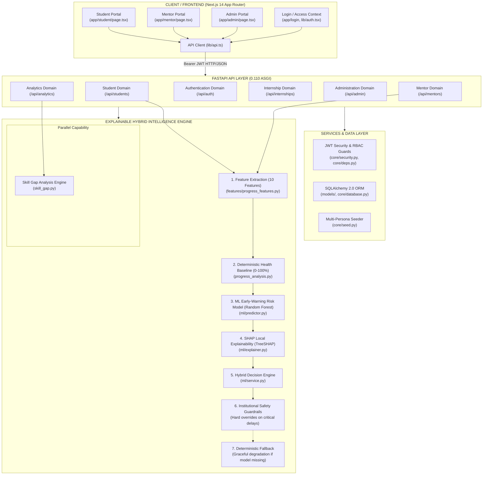

# Smart Internship Management & Monitoring System (EduIntern)

[](https://github.com/patilritesh2006-lgtm/smart-internship-monitoring)
[](https://github.com/patilritesh2006-lgtm/smart-internship-monitoring)
[](https://github.com/patilritesh2006-lgtm/smart-internship-monitoring)
[](https://github.com/patilritesh2006-lgtm/smart-internship-monitoring)
[](https://github.com/patilritesh2006-lgtm/smart-internship-monitoring)

**Smart Internship Management & Monitoring System (SIMMS) is an institutional internship lifecycle platform with an explainable hybrid early-warning intelligence engine.**

$$\mathbf{Frontend\ (Next.js\ 14\ +\ Tailwind\ CSS)} \longleftrightarrow \mathbf{Backend\ (FastAPI\ +\ SQLAlchemy)} \longleftrightarrow \mathbf{Hybrid\ Intelligence\ (Deterministic\ +\ ML\ +\ SHAP)}$$

---

## 1. System Architecture

```text
┌──────────────────────────────────────────────────────────────────────────────────────────────────┐
│                                   CLIENT / FRONTEND LAYER                                        │
│                              Next.js 14.2 App Router (TypeScript)                               │
│                                                                                                  │
│  ┌─────────────────────────┐  ┌─────────────────────────┐  ┌──────────────────────────────────┐  │
│  │     Student Portal      │  │      Mentor Portal      │  │       Administrator Portal       │  │
│  │ • Milestone Task Toggle │  │ • Priority Triage Queue │  │ • Institutional KPI Dashboard    │  │
│  │ • Weekly Report Filing  │  │ • Report Review Form    │  │ • Internship Opportunity Queue   │  │
│  │ • Skill Gap Playground  │  │ • 1-5 Supervisor Rating │  │ • Faculty Allocation Drawer      │  │
│  │ • TreeSHAP Visual Modal │  │ • Log Intervention Modal│  │ • Placement Approvals            │  │
│  │ (app/student/page.tsx)  │  │ (app/mentor/page.tsx)   │  │ (app/admin/page.tsx)             │  │
│  └────────────┬────────────┘  └────────────┬────────────┘  └────────────────┬─────────────────┘  │
│               │                            │                                │                    │
│               └────────────────────────────┼────────────────────────────────┘                    │
│                                            ▼                                                     │
│                ┌───────────────────────────────────────────────────────┐                         │
│                │ Access / Login Context & Authenticated API Client     │                         │
│                │ • Quick 1-Click Persona Login (app/login/page.tsx)    │                         │
│                │ • Session Provider & JWT Storage (lib/auth.tsx)       │                         │
│                │ • Fetch Client with Bearer Interceptor (lib/api.ts)   │                         │
│                └───────────────────────────┬───────────────────────────┘                         │
└────────────────────────────────────────────┼─────────────────────────────────────────────────────┘
                                             │ HTTP / JSON (Bearer JWT Authorization)
                                             ▼
┌──────────────────────────────────────────────────────────────────────────────────────────────────┐
│                                  FASTAPI APPLICATION API LAYER                                   │
│                        FastAPI 0.110 (ASGI Framework) • Pydantic v2 Validation                   │
│                                                                                                  │
│   ┌─────────────────────┐   ┌─────────────────────┐   ┌──────────────────────────────────────┐   │
│   │ Authentication      │   │ Student Domain      │   │ Mentor Domain                        │   │
│   │ • /api/auth/login   │   │ • /api/students/me  │   │ • /api/mentors/me/interns (triage)   │   │
│   │ • /api/auth/register│   │ • /api/students/... │   │ • /api/mentors/students/{id}         │   │
│   │ • /api/auth/me      │   │   (tasks, reports,  │   │ • /api/mentors/reports/{id}/review   │   │
│   │ (routers/auth.py)   │   │    attention status)│   │ • /api/mentors/interventions         │   │
│   └─────────────────────┘   │ (routers/students)  │   │ (routers/mentors.py)                 │   │
│                             └─────────────────────┘   └──────────────────────────────────────┘   │
│   ┌─────────────────────┐   ┌─────────────────────┐   ┌──────────────────────────────────────┐   │
│   │ Internship Domain   │   │ Analytics Domain    │   │ Administration Domain                │   │
│   │ • /api/internships  │   │ • /api/analytics/   │   │ • /api/admin/analytics (KPIs)        │   │
│   │ • /api/internships/ │   │   skill-gap         │   │ • /api/admin/applications (queue)    │   │
│   │   apply             │   │ • /api/analytics/   │   │ • /api/admin/mentors (allocation)    │   │
│   │ (routers/internship)│   │   evaluate-progress │   │ (routers/admin.py)                   │   │
│   └─────────────────────┘   │ (routers/analytics) │   └──────────────────────────────────────┘   │
│                             └─────────────────────┘                                              │
└────────────────────────────────────────────┬─────────────────────────────────────────────────────┘
                                             │
                       ┌─────────────────────┴─────────────────────┐
                       ▼                                           ▼
┌──────────────────────────────────────────────┐ ┌─────────────────────────────────────────────────┐
│           SERVICES / DATA LAYER              │ │           EXPLAINABLE HYBRID INTELLIGENCE       │
│                                              │ │                 ENGINE (offline)                │
│  ┌────────────────────────────────────────┐  │ │                                                 │
│  │ JWT Security & RBAC Guards             │  │ │ ┌─────────────────────────────────────────────┐ │
│  │ • Passlib salted bcrypt password hash  │  │ │ │ 1. Feature Extraction (FeatureExtractor)    │ │
│  │ • PyJWT HS256 stateless tokens         │  │ │ │    Extracts 10 quantitative signals from    │ │
│  │ • Role dependencies: Student/Mentor/   │  │ │ │    milestones, reports & ratings            │ │
│  │   Admin (core/security.py, core/deps)  │  │ │ │    (features/progress_features.py)          │ │
│  └────────────────────────────────────────┘  │ │ └──────────────────────┬──────────────────────┘ │
│  ┌────────────────────────────────────────┐  │ │                        ▼                        │
│  │ Database & SQLAlchemy 2.0 ORM          │  │ │ ┌─────────────────────────────────────────────┐ │
│  │ • Engine & SessionLocal (SQLite/PG)    │  │ │ │ 2. Deterministic Health Baseline            │ │
│  │ • Models: User, Student, Mentor, Task, │  │ │ │    Weighted score (Tasks 40%, Reports 30%,  │ │
│  │   Report, Internship, Application,     │  │ │ │    Ratings 20%, Velocity 10%) → 0-100%      │ │
│  │   Intervention, Skill (models/)        │  │ │ │    (progress_analysis.py)                   │ │
│  └────────────────────────────────────────┘  │ │ └──────────────────────┬──────────────────────┘ │
│  ┌────────────────────────────────────────┐  │ │                        ▼                        │
│  │ Seed Service (core/seed.py)            │  │ │ ┌─────────────────────────────────────────────┐ │
│  │ • Realistic multi-persona seeding      │  │ │ │ 3. ML Early-Warning Risk Model              │ │
│  │ • Calibrated synthetic sample data     │  │ │ │    Pretrained Random Forest Classifier      │ │
│  │ • Deterministic test accounts          │  │ │ │    (ml/predictor.py, ml/artifacts/)         │ │
│  └────────────────────────────────────────┘  │ │ └──────────────────────┬──────────────────────┘ │
│                                              │ │                        ▼                        │
│                                              │ │ ┌─────────────────────────────────────────────┐ │
│                                              │ │ │ 4. SHAP Explainability (SHAPExplainer)      │ │
│                                              │ │ │    TreeSHAP local feature attribution       │ │
│                                              │ │ │    Positive & negative risk contributors    │ │
│                                              │ │ │    (ml/explainer.py)                        │ │
│                                              │ │ └──────────────────────┬──────────────────────┘ │
│                                              │ │                        ▼                        │
│                                              │ │ ┌─────────────────────────────────────────────┐ │
│                                              │ │ │ 5. Hybrid Decision Engine                   │ │
│                                              │ │ │    Combines deterministic ground truth      │ │
│                                              │ │ │    with ML risk probability (ml/service.py) │ │
│                                              │ │ └──────────────────────┬──────────────────────┘ │
│                                              │ │                        ▼                        │
│                                              │ │ ┌─────────────────────────────────────────────┐ │
│                                              │ │ │ 6. Institutional Safety Guardrails          │ │
│                                              │ │ │    Hard policy overrides for inactivity,    │ │
│                                              │ │ │    critical failures, low ratings (<2.0)    │ │
│                                              │ │ └──────────────────────┬──────────────────────┘ │
│                                              │ │                        ▼                        │
│                                              │ │ ┌─────────────────────────────────────────────┐ │
│                                              │ │ │ 7. Deterministic Fallback System            │ │
│                                              │ │ │    Safe degradation to deterministic score  │ │
│                                              │ │ │    if model/SHAP artifacts are unavailable  │ │
│                                              │ │ └─────────────────────────────────────────────┘ │
│                                              │ │                                                 │
│                                              │ │ ══════════════ PARALLEL CAPABILITY ════════════ │
│                                              │ │ ┌─────────────────────────────────────────────┐ │
│                                              │ │ │ Skill Gap Analysis Engine (skill_gap.py)    │ │
│                                              │ │ │ • Case-insensitive keyword normalization    │ │
│                                              │ │ │ • Required vs Student skill set delta       │ │
│                                              │ │ │ • Deterministic curriculum recommendations  │ │
│                                              │ │ │ • Zero external LLM / Cloud dependencies    │ │
│                                              │ │ └─────────────────────────────────────────────┘ │
└──────────────────────────────────────────────┘ └─────────────────────────────────────────────────┘
```

### 1.1 End-to-End Operational Data Flow

```text
  [Student Activity]        [Weekly Reports]          [Mentor Feedback]
  • Milestone task toggle   • Weekly report filing    • Supervisor rating (1-5)
  • Submission timestamp    • Timesheet hours logged  • Qualitative feedback
             │                     │                          │
             └─────────────────────┼──────────────────────────┘
                                   ▼
                   ┌───────────────────────────────┐
                   │   Feature Extraction (10)     │
                   │ • task_completion_rate        │
                   │ • submission_timeliness_rate  │
                   │ • supervisor_rating_avg       │
                   │ • days_since_last_submission  │
                   │ • velocity & trend indicators │
                   └───────────────┬───────────────┘
                                   │
                    ┌──────────────┴──────────────┐
                    ▼                             ▼
       ┌─────────────────────────┐   ┌─────────────────────────┐
       │  Deterministic Health   │   │  ML Early-Warning Risk  │
       │  Ground-Truth Baseline  │   │  RandomForest Classifier│
       │  (Health Score 0-100%)  │   │  (Risk Probability 0-1) │
       └────────────┬────────────┘   └────────────┬────────────┘
                    │                             │
                    │                             ▼
                    │                ┌─────────────────────────┐
                    │                │   TreeSHAP Explainer    │
                    │                │ • Top positive factors  │
                    │                │ • Top negative factors  │
                    │                └────────────┬────────────┘
                    │                             │
                    └──────────────┬──────────────┘
                                   ▼
                   ┌───────────────────────────────┐
                   │    Hybrid Decision Engine     │
                   │ • Reconciles health + ML risk │
                   │ • Enforces Safety Guardrails  │
                   │ • (Deterministic fallback if  │
                   │    model is unavailable)      │
                   └───────────────┬───────────────┘
                                   ▼
                   ┌───────────────────────────────┐
                   │  Actionable Attention Status  │
                   │  ON_TRACK • MONITOR • ATTENTION│
                   │               │               │
                   │               ▼               │
                   │  [Faculty Mentor Review]      │
                   │  Closed-loop intervention log │
                   │  Academic meeting / Tutoring  │
                   └───────────────────────────────┘
```



---

## 2. Key Features & Innovations

### 2.1 Explainable Hybrid Early-Warning Intelligence (`intelligence/`)
The platform combines deterministic ground-truth scoring with predictive machine learning early-warning indicators:

1. **Feature Engineering (`intelligence/app/features/progress_features.py`):**
   - Extracts 10 typed metrics from ORM deliverables: task completion, report submission, mentor feedback, velocity, punctuality, recency, consistency, trend, and days remaining.
   - Non-collinear activity consistency evaluates true calendar cadence:
     $$\text{Consistency} = (0.50 \times \text{Week Coverage}) + (0.30 \times \text{Recency Score}) + (0.20 \times \text{Punctuality Score})$$
2. **Deterministic Progress Health Engine (`intelligence/app/progress_analysis.py`):**
   - Weighted 4-factor scoring establishing baseline progress health:
     $$\text{Score} = (\text{Consistency} \times 0.30) + (\text{Tasks} \times 0.30) + (\text{Reports} \times 0.20) + (\text{Mentor Feedback} \times 0.20)$$
     - $\mathbf{75 - 100} \implies \mathbf{ON\_TRACK}$ (Safe, meeting expected pace)
     - $\mathbf{50 - 74} \implies \mathbf{MONITOR}$ (Warning, minor delays detected)
     - $\mathbf{0 - 4 9} \implies \mathbf{NEEDS\_ATTENTION}$ (Critical early intervention needed)
3. **ML Early-Warning Risk Model (`intelligence/app/ml/`):**
   - `RandomForestClassifier` (Scikit-Learn) with Group-Aware splitting to prevent data leakage.
   - Predicts risk probability ($\hat{p} \in [0, 1]$) indicating whether a student exhibits leading indicators of academic disengagement before deadlines are missed.
4. **SHAP Feature Explainability (`intelligence/app/ml/explainer.py`):**
   - TreeSHAP local feature attributions decompose predictions into top risk drivers and protective factors with plain-language institutional explanations.
5. **Hybrid Institutional Guardrails (`intelligence/app/ml/service.py`):**
   - **Baseline:** Verified completed deliverables form ground truth.
   - **Severe Inactivity Override:** Inactivity $> 21$ days forces status to `MONITOR` or `NEEDS_ATTENTION` regardless of ML confidence.
   - **Early-Warning Escalation:** High ML risk ($\ge 0.65$) on an otherwise on-track student flags proactive check-ins.
6. **Graceful Deterministic Fallback:**
   - If the ML model artifact is offline or uninstalled, the system transparently falls back to pure deterministic scoring with `model_available=False`.
7. **Skill Gap Self-Assessment:**
   - Case-insensitive normalization, set deduplication, and mathematical match calculation:
     $$\text{Match Percentage} = \left(\frac{|\text{Matched Required Skills}|}{|\text{Unique Required Skills}|}\right) \times 100$$

> ⚠️ **Synthetic Data Disclaimer:** The ML early-warning model is a demonstration prototype (`synthetic-v1.1`, trained 2026-09-30) trained on 2,100 synthetic student observations (from 3,000 total observations across 600 unique synthetic students). Pipeline metrics on the held-out test split (**ROC-AUC: 98.74%**, Precision: 85.71%, Recall: 91.14%, F1: 88.34%, Accuracy: 95.78%, Brier Score: 0.0399, ECE: 0.0549) verify pipeline integrity and probabilistic calibration on synthetic distributions. **These metrics are from synthetic demonstration data and do not establish real-world predictive validity.** Model outputs serve exclusively as advisory decision support for human faculty mentors.

### 2.2 Enterprise FastAPI Backend (`backend/`)
- Declarative SQLAlchemy models portable between SQLite (zero-config local dev) and managed PostgreSQL.
- Direct `bcrypt` password hashing with cryptographic salt rounds and signed `PyJWT` access tokens with role guards.
- Dynamic lifespan startup with automatic table initialization and realistic multi-persona seed data.
- 23 comprehensive integration tests verifying end-to-end lifecycle, permissions, and analytics.

### 2.3 Premium Next.js 14 Frontend Application (`frontend/`)
- Built with **Next.js 14 App Router**, **TypeScript**, and **Tailwind CSS**.
- **Integrated Google Stitch Design System (EduIntern):**
  - **Student Workspace:**
    - Live Milestone Task Checklist with day filter pills (`ALL`, `MON`, `TUE`, `WED`, `THU`, `FRI`) and live score recalculation on checkbox toggle.
    - Progress Attention Card with SHAP explainability factors and hybrid early-warning indicators.
    - Interactive Explainable Hybrid Intelligence modal detailing formulas, ML behaviors, and guardrails.
    - Weekly log submission with duplicate prevention (409 Conflict) and instant feedback visualization.
    - Skill Gap Playground comparing student competencies against target internships.
  - **Faculty Mentor Workspace:**
    - Priority triage roster sorting students needing intervention to the top.
    - Modal dialog for interactive 1–100 score rating, constructive feedback, and instant grading.
    - Intervention logging audit trail.
  - **Administrative Command Center:**
    - Institutional KPI cards, student status distributions, and active intervention queue.
    - Pending applications approval queue with faculty mentor allocation.
- **Mobile-First Responsive Layout:**
  - Slide-in navigation drawer on mobile viewports (`< 1024px`).
  - Role-specific 5-tab **Bottom Navigation Bar** for Students, Mentors, and Administrators.
  - Touch-friendly tap targets ($\ge 44\text{px}$) and notch-safe areas (`env(safe-area-inset-bottom)`).
- **Quick 1-Click Demo Login:** Dedicated persona switcher cards on landing and login screens to switch between Student, Mentor, and Admin without typing.

---

## 3. Demo Credentials (Pre-Seeded)

| Persona | Name | Email | Password | Pre-seeded Progress State |
| :--- | :--- | :--- | :--- | :--- |
| **Student (On Track)** | **Rohan Patil** | `student@demo.com` | `Student@123` | Quantum AI Labs • 80% Tasks Done • High Ratings • **ON_TRACK (82.4%)** |
| **Student (On Track)** | Alex Chen | `student.alex@university.edu` | `Student@123` | Google Cloud Intern • 80% Tasks Done • High Ratings • **ON_TRACK (89.4%)** |
| **Student (Monitor)** | Sneha Kulkarni | `student.sara@university.edu` | `Student@123` | TechNova Labs Intern • 50% Tasks Done • Moderate • **MONITOR (53.5%)** |
| **Student (Needs Attention)** | Aditya Joshi | `student.david@university.edu` | `Student@123` | FinEdge Solutions • 20% Tasks Done • Overdue Reports • **NEEDS_ATTENTION (24.0%)** |
| **Faculty Mentor** | **Dr. Alan Turing** | `mentor@demo.com` | `Mentor@123` | Computer Science Professor • Supervises Interns • Priority Triage Roster |
| **Administrator** | **Dean of Engineering** | `admin@demo.com` | `Admin@123` | Full Institutional Oversight • Approvals & Mentor Allocator |

> 💡 **Windows Startup Guide:** For step-by-step instructions on Windows, refer to **[RUN_LOCAL.md](RUN_LOCAL.md)**.  
> 📱 **Responsive Architecture:** For breakpoint details and mobile design patterns, refer to **[RESPONSIVE_DESIGN.md](RESPONSIVE_DESIGN.md)**.  
> 🚢 **Deployment Guide:** For deployment to Render and Vercel, refer to **[DEPLOYMENT_GUIDE.md](DEPLOYMENT_GUIDE.md)**.

---

## 4. Quickstart Guide

### Prerequisites
- Python 3.10+ (Tested with Python 3.14)
- Node.js 18+ & npm (Tested with Node v24.15 & npm 11.12)

### 4.1 Running the Backend Service
```powershell
# From repository root
venv\Scripts\python -m uvicorn backend.app.main:app --reload --port 8000
```
- API Base URL: `http://localhost:8000`
- Interactive OpenAPI Docs: `http://localhost:8000/docs`
- Health Check: `http://localhost:8000/health`

### 4.2 Running the Frontend Application
```powershell
cd frontend
npm install
npm run dev
```
- Web Application: `http://localhost:3000`

### 4.3 Running Automated Pytest Suite (75 Tests)
```powershell
# Run complete test suite across Backend and Hybrid Intelligence
venv\Scripts\python -m pytest backend/tests intelligence/tests -v
```

### 4.4 Running Playwright Automated E2E Test Suite (118 Tests)
```powershell
# Run fast Chromium-only suite (118 tests across 14 categories)
npm run test:e2e:chromium

# Run with interactive Playwright UI mode
npm run test:e2e:ui

# View generated interactive HTML report
npm run test:e2e:report

# Run full cross-browser matrix (354 executions on Chromium, Firefox, Mobile Chrome)
npm run test:e2e
```
*See complete documentation and category breakdown in [TESTING.md](TESTING.md).*

---

## 5. Verification & Testing Evidence

1. **Pytest Suite:** **75 / 75 tests passing (100%)** across 4 test suites:
   - `backend/tests/test_api_integration.py`: 23 tests
   - `intelligence/tests/test_ml_pipeline.py`: 21 tests
   - `intelligence/tests/test_progress_analysis.py`: 17 tests
   - `intelligence/tests/test_skill_gap.py`: 14 tests
2. **Playwright E2E Suite:** **118 / 118 unique test specifications passing (100%)** across 14 modular categories (Startup Health, Auth, Navigation, UI, Forms, CRUD, REST API, Boundary Validation, RBAC Security, Responsive Viewports, Error Handling, a11y, End-to-End User Workflows, and Deep Security Audit). HTML report located in `playwright-report/`.
3. **Frontend Production Build:** Verified via `npm run build` in `frontend/` with zero TypeScript errors and all static routes generated cleanly.
4. **Responsive Mobile Verification:** Tested across mobile (375x667), tablet (768x1024), and desktop (1280x800) viewports.
5. **Deployment Classification:** The system is **deployable after operational configuration** (PostgreSQL provisioning, environment secrets, and reverse-proxy rate limiting).
